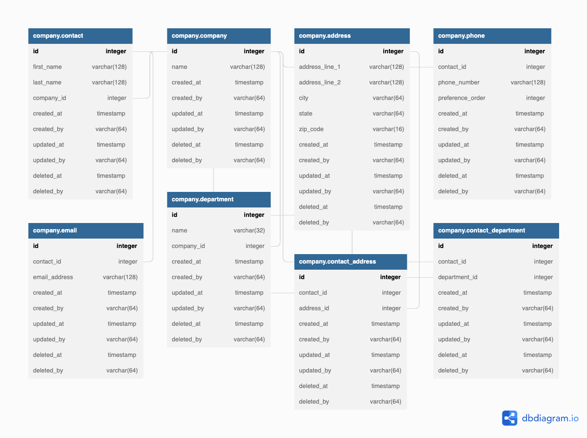

# Data Engineering Project (DE Project)

The **Data Engineering Project** has as main goal to demonstrate how to properly design and develop two things:
- ETL Project
- REST API

This project consists of designing a database to load data based on a sample file shared by our client. Its creation, initial data load, and usage as part of a CRUD API are part of the considerations of such design.

Another relevant component of the project is the development of the different pieces considered relevant during the design process.

## Requirements

- The project can be built with Docker (Compose)
- The project is based on both the Docker compose and sample data files provided by our clients
- All the services can be executed and tested by using Docker (Compose)
- The initial data load happens by pushing the data from the Cent OS machine built with Docker
- The API supports the following actions:
    - Read mechanism to fetch data from the database (must)
    - *Insert mechanism (optional)*
    - *Update mechanism (optional)*
    - *Delete mechanism (optional)*
- The server where the API is going to be deployed must have access only to the postgres
database. And the centos server must have access only to the postgres database as well

## Assumptions

1. Every single one of our contacts work for a single company at a time
2. Our contacts may have more than one address where we may reach them
3. Our contacts at least have one phone number, but may have more than one
4. Our contacts at least have one email address, but may have more than one
5. Our contacts may be working in more than one department at a time (reason why we have more than one record for some of our contacts)
6. Primary keys used when ingesting data into the PostgreSQL database are the first_name and last_name
7. In case an entity is found twice in the CSV the following logics is going to be applied:
7.1 If the department is different proceed to insert it as a new relationship with our contact
7.2 If the address is different proceed to insert it as a new relationship with our contact (no record has that condition in the sample CSV, but adding the assumption since it seems like a nice opportunity to make it more interesting)

## Entity-Relationship Diagram

# Project Structure

## data
This directory stores the files with the data for the initial data loading process.

## documentation
This folder stores the files that explain technically the project and its
components.

## sql

### init
This path stores the `.sql` file(s) that creates the database overall structure for our Data Engineering Project.

# Installation

# Usage

# Final Thoughts
